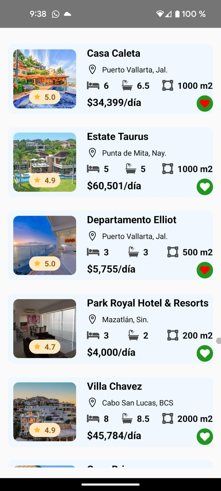

# App Inmobiliaria
* [Descripción](#descripción)
* [Instalar dependencias](#instalar-dependencias)
* [Correr proyecto](#Correr-proyecto)
* [Resultado](#Resultado)
* [Créditos](#Créditos)

## Descripción
Una empresa inmobiliaria necesita una App para poder mostrar a sus clientes las propiedades que tiene disponibles en renta.

1. La App debe permitir a la empresa inmobiliaria mostrar un listado de todas las propiedades disponibles para renta.
2. Para cada propiedad, se debe mostrar la siguiente información:
   - Nombre
   - Dirección
   - Número de habitaciones
   - Número de baños
   - Superficie
   - Costo de renta mensual
   - Evaluación o calificación de la propiedad
   - Icono que permita al usuario marcar las propiedades que le gustan.

## Instalar dependencias 
En el proyecto se utilizaron las dependencias:
- **Eslint** (herramienta que ayuda a cumplir buenas prácticas de codificación).
- **Jest** (para ejecutar las pruebas del código).

Por lo que para instalarlas y posteriormente ejecutarlas, lo que se debe hacer primero es abrir una terminal en el proyecto y ejecutar el comando 
`npm install`
Una vez que ya se instalaron las dependencias, para ejecutar el *ambiente de pruebas* se debe ejecutar el comando 
`npm test` 

## Correr proyecto
Para ejecutar el proyecto en Android:
`npx react-native run-android`

Para ejecutar el proyecto en IOS:
`npx react-native run-ios`

## Resultado

## Créditos
- [Alberto García (*AlbertoG22*)](https://github.com/AlbertoG22)

## Badges
